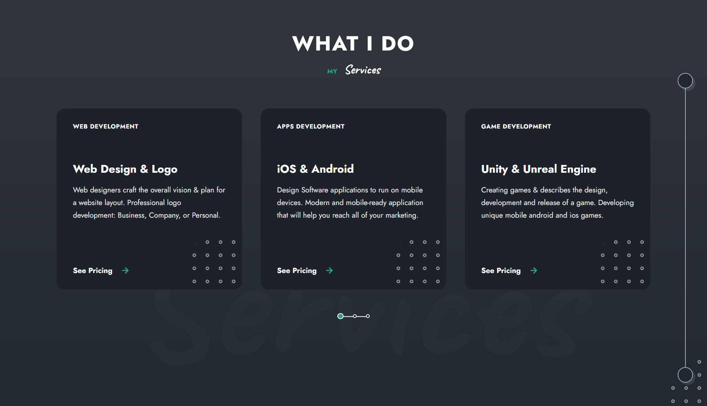

# React Portfolio 03
This design is inspired by the following videos: [Part 1](https://youtu.be/CShZJmWuTGs), [Part 2](https://youtu.be/I92RzWVF4YU), [Part 3](https://youtu.be/hHEFbYSLgN8), which belongs to [Cryptical Coder](https://www.youtube.com/@CrypticalCoder).

## Technologies
This web page was made with the following technologies:
- HTML5
- CSS3
- JavaScript
- React (useState, useEffect)
- Axios
- Framer Motion
- React Icons
- React Scroll
- Swiper

## Pages
This web page contains 9 sections: **Home**, **Services**, **Skills**, **Portfolio**, **Resume**, **Testimonials**, **Pricing**, **Blog** and **Contact**.

### Home
#### In this section you will see the title of the web page, a subtitle, a short description and a button to download the CV, and another button to go to the skills section. And on the right side, an image with information about the years of experience and the projects carried out.

### Services
#### In this section, you will see the section title, a subtitle, and a list of services offered. Each service has a short description and a title. Also, there is a button that goes to the pricing section.

### Skills
#### In this section you will see a list of skills that I have. Each ability has a short description and a percentage, depending on how well I know how to handle it.

### Portfolio
#### In this section you will see all the projects that have been carried out. Each project has a short description, a title, the area to which it belongs and a button that goes to the price section. There are four areas: Dranding, UI UX Design, Development and Photography.

### Resume
#### In this section you can see my information about my studies and my work experience.

### Testimonials
#### In this section you can see the testimonials of my satisfied customers.

### Pricing
#### In this section you can see the prices of the services offered. You will be able to see the price per hour, week and month according to the one that seems most accessible to you.

### Blog
#### In this section you can see a list of the latest blogs that have been published. Each one has its publication date, a title, and a brief description.

### Contact
#### In this section you will see a form where you can fill in your data. The form is functional. On the left side you can see information such as my email and my phone number.

